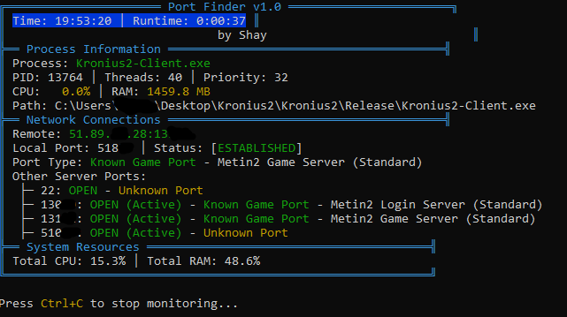

<div align="center">

# 🔍 Port Finder v1.0

### Developed by Shaay | 2024 Edition

[](https://github.com/ShayRed/Port-Finder)
[](https://www.python.org)
[](https://opensource.org/licenses/MIT)
[](https://github.com/ShayRed/Port-Finder)

<p align="center">
  
</p>

Advanced real-time network monitoring tool specifically designed for Metin2 and game servers. 
Monitor connections, analyze network traffic, and track server performance with an elegant CLI interface.

[Features](#-features) •
[Installation](#-installation) •
[Usage](#-usage) •
[Technical Details](#%EF%B8%8F-technical-details) •
[License](#-license)


## ⚠️ Antivirus Notice

Some antivirus programs may report a false positive. This is due to the way the program is compiled into an EXE file. 
The tool is completely safe and is designed specifically for:

- Game server monitoring
- Network connection analysis
- Process performance tracking

If you receive a warning:
1. Add the folder to your antivirus exceptions
2. Use the "Run anyway" option

This is a common occurrence with network monitoring tools as they require system access to analyze connections and processes.

## 🔒 Security

- No data collection or transmission
- Purely local analysis
- Only monitors specified game processes
- No system modifications

## 🛡️ Technical Safety Details

The tool only performs:
- Port scanning of specified ranges
- Memory reading of selected processes
- Network traffic monitoring
- System resource analysis

All operations are:
- Visible in real-time through the interface
- Limited to game-related processes
- Locally executed
- Non-invasive monitoring only

</div>

## ✨ Features

### 🔄 Real-time Monitoring
- Process CPU & RAM usage
- Active network connections
- System resource utilization
- Thread count and process priority

### 🌐 Advanced Port Analysis
- Instant port detection via netstat integration
- Background port scanning
- Port type recognition
- Server connection mapping

### 🎮 Game Server Features
- Specialized Metin2 server port detection
- Game server type identification
- Multi-connection monitoring
- Server status tracking

### 💻 User Interface
- Clean, modern CLI design
- Color-coded information
- Progress tracking
- Real-time updates

## 🚀 Installation

1. Go to [Releases](https://github.com/ShayRed/Port-Finder/releases)
2. Download the latest `PortFinder.exe`
3. Place it in your desired location

**System Requirements:**
- Windows 7/8/10/11
- Administrator privileges (for port scanning)
- 4GB RAM recommended

## 🎮 Usage

1. **Start the Tool:**
   - Double-click `PortFinder.exe`
   - Or run as administrator for full functionality

2. **Main Menu:**
   - Select option [1] for Process Monitor
   - Select option [2] to Exit

3. **Process Monitoring:**
   - Enter the game process name (default: Metin2.exe)
   - Watch real-time information
   - Press Ctrl+C to stop monitoring

4. **Understanding the Display:**
   ```
   ╔══ Process Monitor ══╗
   ║ Process Information
   ║ Network Connections
   ║ System Resources
   ╚═══════════════════╝
   ```

## ⚙️ Technical Details

### Supported Port Types
| Server Type | Port Range |
|------------|------------|
| Login Server (Standard) | 13000-13100 |
| Game Server (Standard) | 13100-13300 |
| P-Server Ports | 10000-10300 |
| Custom Server Ports | 8000-8300 |

### Features in Detail
- Real-time process monitoring
- Active connection tracking
- Port type recognition
- Server status analysis
- System resource monitoring

## 📄 License

This project is licensed under the MIT License - see the [LICENSE](LICENSE) file for details.

## ❗ Important Notes

- Run as administrator for full functionality
- Firewall might ask for permission on first run
- For game servers only - do not use for unauthorized scanning

---

<div align="center">

### Made with ❤️ by Shaay

[](https://github.com/ShayRed)

</div>
